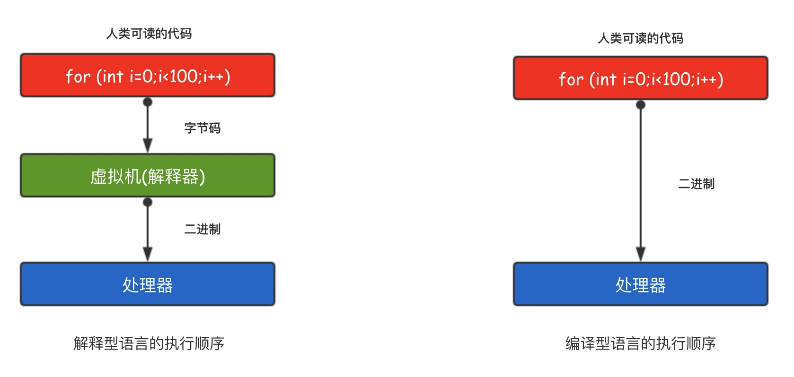

# 学习前须知

## 1.GO语言特点

Go语言的并发是基于 `goroutine` 的，`goroutine` 类似于线程，但并非线程。可以将 `goroutine` 理解为一种虚拟线程。Go 语言运行时会参与调度 `goroutine`，并将 `goroutine` 合理地分配到每个 CPU 中，最大限度地使用CPU性能。开启一个`goroutine`的消耗非常小（大约2KB的内存），你可以轻松创建数百万个`goroutine`。

`goroutine`的特点：

1. `goroutine`具有可增长的分段堆栈。这意味着它们只在需要时才会使用更多内存。
2. `goroutine`的启动时间比线程快。
3. `goroutine`原生支持利用channel安全地进行通信。
4. `goroutine`共享数据结构时无需使用互斥锁。

## 2.Go性能强悍

与其他现代高级语言（如Java/Python）相比，使用C，C++的最大好处是它们的性能。因为C/ C++是编译型语言而不是解释的语言。 处理器只能理解二进制文件，Java和Python这种高级语言在运行的时候需要先将人类可读的代码翻译成字节码，然后由专门的解释器再转变成处理器可以理解的二进制文件。

同C,C++一样，Go语言也是编译型的语言，它直接将人类可读的代码编译成了处理器可以直接运行的二进制文件，执行效率更高，性能更好。

## 3.搭建环境

见李文周的博客里面有详细的介绍

[李文周的博客](https://www.liwenzhou.com/posts/Go/install_go_dev/)

## 4.GO语言命令

`go build`:编译go程序

`go build -o "xxx.exe"`：编译成xx.exe文件

`go run mian.go`:像执行脚本一样执行mian.go文件

`go install`：先编译后拷贝

